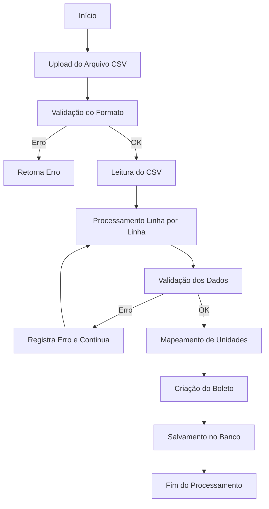
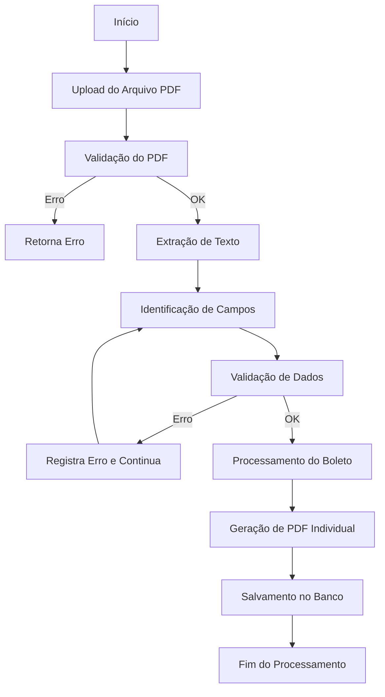
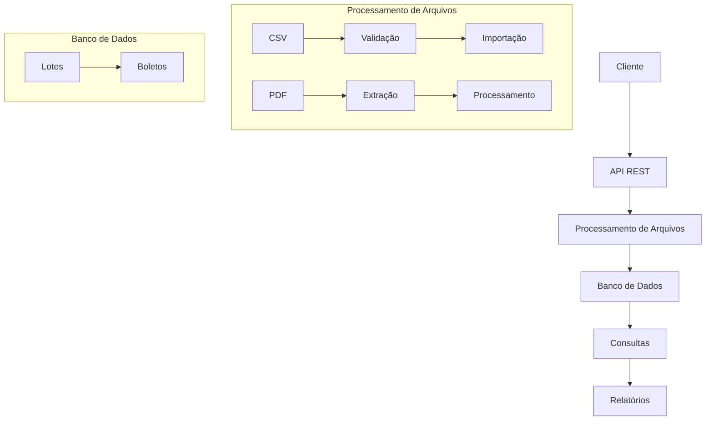

# Documentação Técnica - Sistema de Importação de Boletos

## 🏗️ Arquitetura do Sistema

### Tecnologias Principais
- **Backend**: Node.js + TypeScript
- **Banco de Dados**: PostgreSQL
- **ORM**: Sequelize
- **Framework Web**: Express
- **Processamento de PDF**: PDF-lib
- **Processamento de CSV**: csv-parse

### Estrutura de Diretórios
```
backend/
├── src/
│   ├── config/         # Configurações do sistema
│   ├── controllers/    # Controladores da API
│   ├── models/         # Modelos do banco de dados
│   ├── routes/         # Rotas da API
│   ├── services/       # Serviços de negócio
│   ├── migrations/     # Migrações do banco
│   └── server.ts       # Ponto de entrada
├── uploads/            # Arquivos temporários
└── docs/              # Documentação e exemplos
```

## 💾 Banco de Dados

### Tabela `lotes`
```sql
CREATE TABLE lotes (
    id INT NOT NULL PRIMARY KEY AUTO_INCREMENT,
    nome VARCHAR(100) NOT NULL,
    ativo BOOLEAN NOT NULL DEFAULT true,
    criado_em TIMESTAMP NOT NULL DEFAULT CURRENT_TIMESTAMP
);
```

### Tabela `boletos`
```sql
CREATE TABLE boletos (
    id INT NOT NULL PRIMARY KEY AUTO_INCREMENT,
    nome_sacado VARCHAR(255) NOT NULL,
    id_lote INT NOT NULL,
    valor DECIMAL(10,2) NOT NULL,
    linha_digitavel VARCHAR(255) NOT NULL,
    ativo BOOLEAN NOT NULL DEFAULT true,
    criado_em TIMESTAMP NOT NULL DEFAULT CURRENT_TIMESTAMP,
    FOREIGN KEY (id_lote) REFERENCES lotes(id)
);
```

### Índices
- `boletos(id_lote)`: Índice para otimizar consultas por lote

## 🔄 Migrações

### Estrutura das Migrações
```
src/migrations/
├── 20240320000000-create-lotes.js
└── 20240320000001-create-boletos.js
```

### Comandos Disponíveis
```bash
# Executar todas as migrações pendentes
npm run migrate

# Desfazer a última migração
npm run migrate:undo

# Desfazer todas as migrações
npm run migrate:undo:all
```

### Migração: Criar Tabela Lotes
```javascript
'use strict';

module.exports = {
  up: async (queryInterface, Sequelize) => {
    await queryInterface.createTable('lotes', {
      id: {
        type: Sequelize.INTEGER,
        primaryKey: true,
        autoIncrement: true,
        allowNull: false
      },
      nome: {
        type: Sequelize.STRING(100),
        allowNull: false
      },
      ativo: {
        type: Sequelize.BOOLEAN,
        allowNull: false,
        defaultValue: true
      },
      criado_em: {
        type: Sequelize.DATE,
        allowNull: false,
        defaultValue: Sequelize.literal('CURRENT_TIMESTAMP')
      }
    });
  },

  down: async (queryInterface, Sequelize) => {
    await queryInterface.dropTable('lotes');
  }
};
```

### Migração: Criar Tabela Boletos
```javascript
'use strict';

module.exports = {
  up: async (queryInterface, Sequelize) => {
    await queryInterface.createTable('boletos', {
      id: {
        type: Sequelize.INTEGER,
        primaryKey: true,
        autoIncrement: true,
        allowNull: false
      },
      nome_sacado: {
        type: Sequelize.STRING(255),
        allowNull: false
      },
      id_lote: {
        type: Sequelize.INTEGER,
        allowNull: false,
        references: {
          model: 'lotes',
          key: 'id'
        }
      },
      valor: {
        type: Sequelize.DECIMAL(10, 2),
        allowNull: false
      },
      linha_digitavel: {
        type: Sequelize.STRING(255),
        allowNull: false
      },
      ativo: {
        type: Sequelize.BOOLEAN,
        allowNull: false,
        defaultValue: true
      },
      criado_em: {
        type: Sequelize.DATE,
        allowNull: false,
        defaultValue: Sequelize.literal('CURRENT_TIMESTAMP')
      }
    });

    await queryInterface.addIndex('boletos', ['id_lote']);
  },

  down: async (queryInterface, Sequelize) => {
    await queryInterface.dropTable('boletos');
  }
};
```

### Fluxo de Migração
1. **Desenvolvimento**
   - Crie novas migrações quando necessário
   - Teste as migrações localmente
   - Verifique o histórico de migrações

2. **Produção**
   - Execute migrações em ordem
   - Mantenha backup antes de migrar
   - Monitore o processo de migração

3. **Rollback**
   - Use `migrate:undo` para desfazer uma migração
   - Use `migrate:undo:all` em caso de problemas graves
   - Verifique o estado do banco após rollback

## 🔌 API Endpoints

### Importação de CSV
```http
POST /api/import-csv
Content-Type: multipart/form-data

file: [arquivo.csv]
```

**Formato do CSV**
```csv
nome_sacado,id_lote,valor,linha_digitavel
João Silva,3,150.50,3419175008000011104480000000012345844600000015050
```

### Importação de PDF
```http
POST /api/import-pdf
Content-Type: multipart/form-data

file: [arquivo.pdf]
```

### Consulta de Boletos
```http
GET /boletos
GET /boletos?nome=João&valor_inicial=100&valor_final=200&id_lote=3
GET /boletos?relatorio=1
```

## 📄 Processamento de Arquivos

### CSV
1. Validação do formato
2. Extração dos dados
3. Mapeamento de unidades
4. Criação de boletos

### PDF
1. Extração de texto
2. Identificação de campos
3. Validação de dados
4. Geração de PDFs individuais

## 🔄 Mapeamento de Unidades

### Regras de Mapeamento
- Unidade "17" → ID_LOTE = 3
- Unidade "18" → ID_LOTE = 6

### Processo
1. Recebe nome da unidade
2. Formata para padrão interno
3. Busca ID correspondente
4. Cria lote se não existir

## 📊 Logs e Monitoramento

### Níveis de Log
- ERROR: Erros críticos
- WARN: Avisos importantes
- INFO: Informações gerais
- DEBUG: Detalhes para desenvolvimento

### Estrutura do Log
```json
{
  "timestamp": "2024-03-20T10:00:00Z",
  "level": "INFO",
  "message": "Boleto criado com sucesso",
  "data": {
    "id": 1,
    "nome_sacado": "João Silva",
    "id_lote": 3
  }
}
```

## ⚙️ Configuração do Ambiente

### Variáveis de Ambiente
```env
DB_HOST=localhost
DB_PORT=5432
DB_NAME=seu_banco
DB_USER=seu_usuario
DB_PASSWORD=sua_senha
NODE_ENV=development
```

### Scripts Disponíveis
```bash
# Desenvolvimento
npm run dev

# Produção
npm run build
npm run start

# Migrações
npm run migrate
npm run migrate:undo
npm run migrate:undo:all

# Testes
npm run generate-test-pdf
```

## 🛠️ Ferramentas de Desenvolvimento

### Postman
- Coleção disponível em: `docs/postman_collection.json`
- Inclui exemplos de todas as requisições

### Banco de Dados
- PostgreSQL 12+
- pgAdmin para administração

### IDE Recomendada
- Visual Studio Code
- Extensões:
  - ESLint
  - Prettier
  - TypeScript
  - PostgreSQL 

## 📊 Fluxo de Processos

### Fluxo de Importação de CSV


### Fluxo de Importação de PDF


### Fluxo Geral do Sistema
